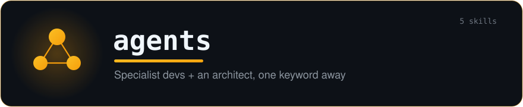

<div align="center">



### Specialist devs + an architect, **one keyword away**.

A Claude Code plugin bundling **five specialized development agents as skills**. Say *"implement story"*, *"refactor"* or *"design architecture"* and the right specialist takes over — implementation, tests, review, refactoring, or pattern-based design with ADRs.

[](./.claude-plugin/plugin.json)
[](https://docs.claude.com/en/docs/claude-code)
[](#-the-agents)
[](https://github.com/yoannyviquel/marketplace)

```sh
/plugin marketplace add yoannyviquel/marketplace
/plugin install agents
```

</div>

---

> Plug-and-play specialists — no setup, no config. After install the skills are live, triggered automatically by what you ask. Each one starts from a clean baseline (developers run `git fetch` → `checkout master` → `pull` first) and works incrementally with TodoWrite + TDD.

## 🤖 The agents

### 🛠️ Developers

| Skill | Specialty | Standout |
|---|---|---|
| `dotnet-developer` | .NET user stories — C#, .NET Framework / Core | 90%+ coverage; delegates to `dotnet-test` / `dotnet-msbuild` / `dotnet-diag` skills when installed |
| `react-developer` | React / TypeScript user stories | **Atomic Design enforced** (atoms → molecules → organisms → templates → pages), unidirectional imports |
| `nodejs-developer` | Node.js backends — APIs, services, CLIs, workers | Express / Fastify / NestJS; clean tested endpoints |
| `ios-game-developer` | iOS games — Swift, SpriteKit, SceneKit, Metal, GameplayKit | logic/render separation, frame-budget aware |

**Trigger keywords:** `implement story`, `dev story`, `code`, `implement`, `build feature`, `fix bug`, `write tests`, `code review`, `refactor` (plus stack-specific: `api` / `endpoint` / `backend` for Node, `sprite` / `scene` / `gameplay` / `frame rate` for iOS).

Each developer agent: understands the story → plans via TodoWrite → implements with TDD → validates acceptance criteria, coverage and linting → reviews. Working software first, quality over speed.

### 🏛️ Architect

| Skill | Specialty | Standout |
|---|---|---|
| `code-architect` | Software architecture grounded in design patterns | Bundled ***Dive Into Design Patterns*** KB — **22 GoF patterns + OOP/SOLID principles + examples in 10 languages** |

**Trigger keywords:** `design architecture`, `architect this`, `propose a design`, `which pattern`, `design pattern`, `architecture plan`, `ADR`, `refactor design`, `structure this feature`.

Procedure: clarify the functional need (asks when unclear) → explore the codebase and **map impact at 3 levels** (core, immediate surroundings, system ripple) → consult the bundled references and select adequate pattern(s) with trade-offs → deliver an **Architecture Plan** → on approval, produce **ADRs** + a Claude Code development plan. Pragmatic (no over-engineering), transparent (every recommendation traceable to a reference), honest about uncertainty.

## 🎬 How triggering works

```text
> implement the seller-status consumer story

  → agents:dotnet-developer takes over
    1. git fetch · checkout master · pull   (clean baseline)
    2. plan the story as TodoWrite items
    3. implement incrementally with TDD
    4. validate acceptance criteria + coverage

> which pattern fits a pluggable notification pipeline?

  → agents:code-architect takes over
    consults the GoF knowledge base → proposes Strategy + Observer,
    maps impact, presents trade-offs, then writes the ADR on approval
```

You can also invoke a skill explicitly via the Skill tool, e.g. `Skill(skill: "agents:react-developer")`.

## 🚀 Install

```text
/plugin marketplace add yoannyviquel/marketplace
/plugin install agents
```

The skills become available immediately — no build step (pure Markdown + bundled knowledge base).

## 📁 Structure

<details>
<summary><b>Repository layout</b></summary>

```text
agents/
├── .claude-plugin/plugin.json
├── package.json
└── skills/
    ├── dotnet-developer/      SKILL.md + resources/ + templates/
    ├── react-developer/       SKILL.md + resources/ + templates/ + scripts/
    ├── nodejs-developer/      SKILL.md + resources/ + templates/ + scripts/
    ├── ios-game-developer/    SKILL.md + resources/ + templates/
    └── code-architect/
        ├── SKILL.md
        └── references/
            ├── patterns-index.md
            ├── principles/        # OOP, design principles, SOLID
            ├── creational/ structural/ behavioral/   # 22 pattern sheets
            └── code-examples/      # examples in 10 languages + INDEX.md
```

</details>

---

<div align="center">

© Yoann Yviquel · Part of the [**yoannyviquel** marketplace](https://github.com/yoannyviquel/marketplace)

</div>
